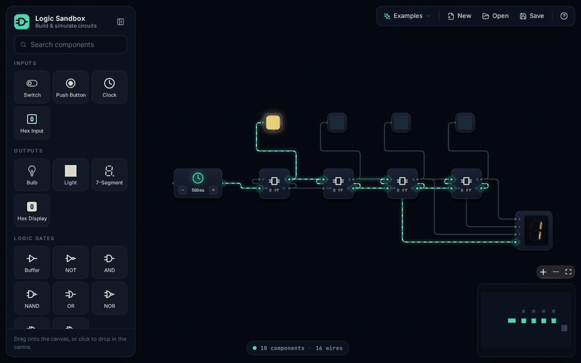
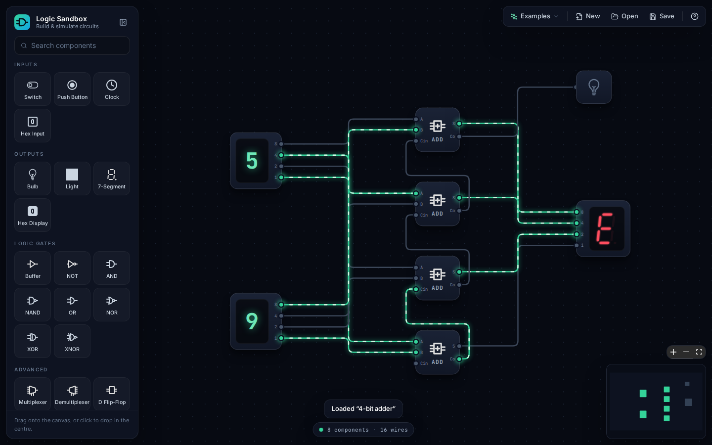
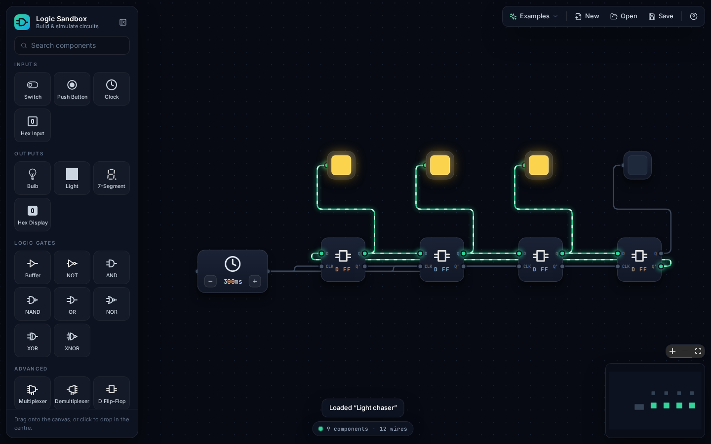

<div align="center">


# Logic Sandbox

**Build and simulate digital logic circuits right in your browser.**

Drag in switches, gates, flip-flops and displays, wire them together and watch the signals flow in real time.

### [▶&nbsp; Open Logic Sandbox](https://tomwhitticase.github.io/logic-sanbdbox/)

[](https://github.com/TomWhitticase/logic-sanbdbox/actions/workflows/deploy-pages.yml)


<br />



</div>

## Features

- **Live simulation:** wires glow and animate while they carry a signal, so you can watch values ripple through a circuit.
- **20 components** across inputs, outputs, logic gates and larger building blocks.
- **9 ready-made examples**, from a two-gate blinker to a 4-bit adder and a Johnson-counter light chaser.
- **Friendly editor:** drag and drop, rotate, duplicate, multi-select, cut, copy and paste.
- **Built-in help** for every component, with a live preview.
- **Nothing to lose:** your circuit autosaves in the browser, and you can save it to (or open it from) a JSON file.

<table>
  <tr>
    <td></td>
    <td></td>
  </tr>
  <tr>
    <td align="center"><sub>A 4-bit adder: 5 + 9 = E</sub></td>
    <td align="center"><sub>A Johnson counter chasing lights</sub></td>
  </tr>
</table>

## Components

| Category    | Components                                                    |
| ----------- | ------------------------------------------------------------- |
| Inputs      | Switch, Push Button (momentary), Clock (adjustable), Hex Input |
| Outputs     | Bulb, Light, 7-Segment Display, Hex Display                   |
| Logic gates | Buffer, NOT, AND, NAND, OR, NOR, XOR, XNOR                    |
| Advanced    | Multiplexer (4:1), Demultiplexer (1:4), D Flip-Flop, Full Adder |

Right-click any component on the canvas and choose **How it works** to see what each pin does.

## Examples

Open the **Examples** menu in the toolbar to load any of these:

| Example         | What it shows                                                  |
| --------------- | -------------------------------------------------------------- |
| Blinker         | A clock and a NOT gate alternating two bulbs                   |
| Half adder      | Adding two bits with XOR and AND                               |
| SR latch        | Two cross-coupled NOR gates storing a bit (press Set / Reset)  |
| Hex decoder     | A hex digit split into its four binary bits                    |
| Data selector   | A multiplexer picking one of four inputs                       |
| 4-bit adder     | Four chained full adders adding two hex digits, with carry out |
| 4-bit counter   | A ripple counter made of D flip-flops, shown on a hex display  |
| Light sequencer | A 2-bit counter driving a demultiplexer                        |
| Light chaser    | A Johnson counter shifting a pattern around four lights        |

## Controls

| Action                          | How                                  |
| ------------------------------- | ------------------------------------ |
| Add a component                 | Drag it from the panel, or click it  |
| Connect two components          | Drag from an output dot to an input dot |
| Rotate, duplicate, delete, help | Right-click a component              |
| Select several components       | <kbd>Shift</kbd> + drag              |
| Select everything               | <kbd>Ctrl</kbd>/<kbd>⌘</kbd> + <kbd>A</kbd> |
| Copy / cut / paste              | <kbd>Ctrl</kbd>/<kbd>⌘</kbd> + <kbd>C</kbd> / <kbd>X</kbd> / <kbd>V</kbd> |
| Delete the selection            | <kbd>Delete</kbd> or <kbd>Backspace</kbd> |
| Pan / zoom                      | Drag the background / scroll         |

## Running locally

You'll need [Node.js](https://nodejs.org) 18 or newer.

```sh
git clone https://github.com/TomWhitticase/logic-sanbdbox.git
cd logic-sanbdbox
npm install
npm run dev
```

| Script            | What it does                              |
| ----------------- | ----------------------------------------- |
| `npm run dev`     | Start the dev server with hot reload      |
| `npm run build`   | Type-check and build for production       |
| `npm run preview` | Serve the production build locally        |
| `npm run lint`    | Run ESLint                                |

## How it works

Each component is a [React Flow](https://reactflow.dev) node. A node reads the signals on its input handles from the nodes wired to it, computes its outputs, and publishes them in its data. Output updates are batched and applied once per tick, which works like a tiny propagation delay: signals ripple through a circuit step by step, and circuits with feedback (latches, oscillators) behave sensibly instead of looping forever.

```
src/
├── components/nodes/   one file per component, plus shared gate and chip bodies
├── components/menus/   component panel, toolbar, context menu, help, status bar
├── components/edges/   the animated wire
├── constants/          component registry and example circuits
├── simulation/         the output update scheduler
└── hooks/              reading inputs, writing outputs, loading circuits
```

## Deployment

Every push to `main` is built and published to GitHub Pages by [`.github/workflows/deploy-pages.yml`](.github/workflows/deploy-pages.yml).

Built with React, TypeScript, Vite, Tailwind CSS and React Flow by [Tom Whitticase](https://tomwhitticase.com).
